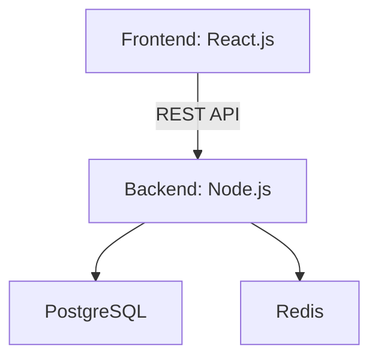

# media-scraper

## Requirements

- Create an API that will accept an array of Web URL in the request Body.
- Scrap Image and Video URLs for requested Web URL's.
- Store All Data into any SQL database.
- Create a simple web page for showing all the Images and Video's.
- Paginate the front-end API and we can filter data based upon type and search text.
- Use Node.js for the backend and React.js for the front-end.
- Dockerize your code using Docker Compose or any Docker orchestrator that can be run on personal computers.
- Do have the demo video of the working delivered submission included.
- The system should be able to efficiently handle ~5000 scraping requests at the same time, considering a server with only 1 CPU and 1GB RAM and write a load test for this feature.

## Technical specifications

Overview architecture

### Frontend

- Vite + React, TypeScript
- Axios for API calls
- Tailwind CSS for styling

### Backend

- Node.js with NestJS + Fastify framework
- TypeORM for database interactions
- PostgreSQL as the SQL database
- Redis for caching and rate limiting, queue management (if needed)
- Cheerio and Axios for web scraping
- Jest for testing

### Deployment

- Docker and Docker Compose for containerization and orchestration
