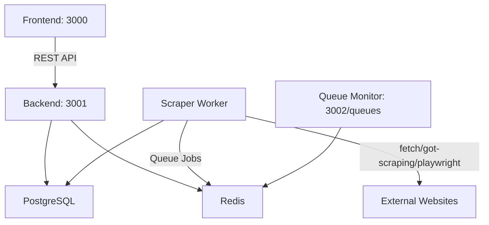

# media-scraper

## Description

A media scraper application that accepts an array of web URLs, scrapes image and video URLs from those pages, stores the data in a SQL database, and provides a web interface to view the scraped media with pagination and filtering options. The application is built using Node.js for the backend and React.js for the frontend, and is containerized using Docker.

## What are the advantages?

- Efficient scraping using concurrency/automatically retries and queue management with Bull and Redis.
- Robust scraping capabilities using Cheerio, fetch, got-scraping, and Playwright for static and dynamic content.
- Scalable architecture that can handle a large number of scraping requests with limited resources.

## Demo

[Demo Video](https://drive.google.com/file/d/1N39GWUUd9MPTl9DV0MB2zFsprCO4xgAV/view?usp=sharing)

## Requirements

- Create an API that will accept an array of Web URL in the request Body.
- Scrap Image and Video URLs for requested Web URL's.
- Store All Data into any SQL database.
- Create a simple web page for showing all the Images and Video's.
- Paginate the front-end API and we can filter data based upon type and search text.
- Use Node.js for the backend and React.js for the front-end.
- Dockerize your code using Docker Compose or any Docker orchestrator that can be run on personal computers.
- Do have the demo video of the working delivered submission included.
- The system should be able to efficiently handle ~5000 scraping requests at the same time, considering a server with only 1 CPU and 1GB RAM and write a load test for this feature.

## Technical specifications

Overview architecture



### Frontend

- Vite + React, TypeScript
- Axios for API calls
- Tailwind CSS for styling

### Backend

- Node.js with NestJS + Fastify framework
- TypeORM for database interactions
- PostgreSQL as the SQL database
- Redis for caching and rate limiting, queue management

- Cheerio and fetch (default) or got-scraping (in-case fetch failed by bot checking) or playwright/puppeteer (for dynamic rendering) for web scraping
- Jest for testing

### Deployment

- Docker and Docker Compose for containerization and orchestration

## How to run

1. Clone the repository and navigate to the `media-scraper` directory
2. Copy `.env.example` to `.env` and adjust settings if necessary
3. Run `docker-compose up --build` to start the services
4. Access the frontend at http://localhost:3000
5. Access the Bull Board for queue monitoring at http://localhost:3002/queues/queue/scraper

### Testing

1. Open UI at http://localhost:3000
2. Input multiple URLs in the textarea, example:

   ```text
    https://www.wikipedia.org/
    https://unsplash.com/s/photos/city
    https://www.pexels.com/search/videos/ocean
    https://archive.org/details/911
    https://webscraper.io/test-sites/e-commerce/static/computers/laptops?page=2
    https://books.toscrape.com/catalogue/page-2.html
   ```

3. Click "Scrape" to submit the URLs for scraping
4. Monitor the queue processing at `http://localhost:3002/queues/queue/scraper/scraper`
5. Once processing is complete, the media results will be displayed on the frontend with pagination and filtering options

### Load testing

1. Ensure the services are running as per the above instructions
2. Open a terminal and navigate to the `media-scraper-service` directory
3. Run the load test script using:

   ```bash
    npx ts-node load-test/load-test.ts
   ```

4. Monitor the output for performance metrics and any errors

### Tips

- For inspecting media-scraper-service:

  ```bash
   docker ps
   # Find container name, ex: media-scraper-media-scraper-service-1
   # Inspect
   docker stats media-scraper-media-scraper-service-1
  ```

## Future improvements

- Base on specific domain/url of real business, update static/dynamic content detection with a more robust solution
- Add support for more media types (e.g., audio, documents)
- Implement user authentication and authorization
- UI:
  - Polling(or websocket) to auto-refresh medias/sources result/status
  - Styling improvements
  - View detail media/source in a modal/lightbox
- For production we can separate api server and scraper worker to scale independently.
- Metric collection and monitoring (e.g., Prometheus, Grafana)
